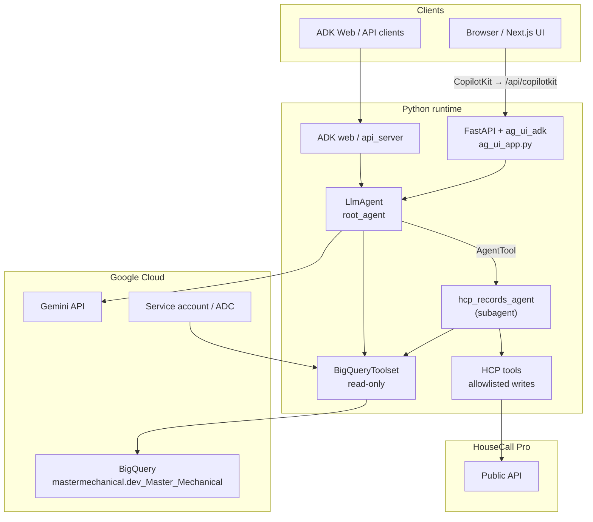
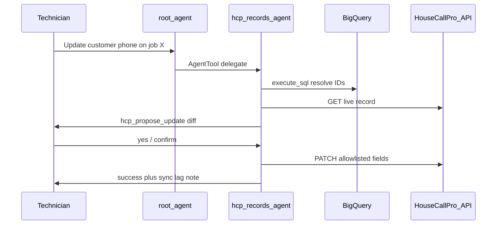
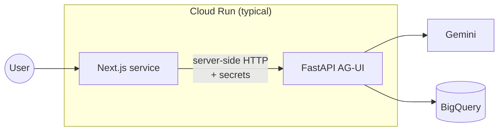

# Master Mechanical Agent — Architecture

This document describes how the repository is structured, how requests flow through the system, and how the main runtime pieces interact. It complements the operational setup in [`README.md`](README.md).

## High-level overview

The project delivers an **HVAC-focused assistant** backed by **Google Gemini** (via the [Google Agent Development Kit, ADK](https://github.com/google/adk-python)) with **read-only BigQuery** access to Master Mechanical business data (`mastermechanical.dev_Master_Mechanical`).

There are **three ways** to run the agent:

| Mode | Entry | Typical use |
|------|--------|-------------|
| ADK Web UI | `uv run adk web src/agents` | Local interactive dev against the ADK dev server |
| ADK API server | `uv run adk api_server src/agents/MasterMechanicalAgent` | HTTP API for integrations / Cloud Run-style serving |
| Custom UI | FastAPI **AG-UI** (`ag_ui_app.py`) + **Next.js** (CopilotKit) | Production-style chat with Google sign-in and per-user sessions |

The **canonical agent definition** is a single `LlmAgent` instance (`root_agent`) in [`src/agents/MasterMechanicalAgent/agent.py`](src/agents/MasterMechanicalAgent/agent.py). It delegates HouseCall Pro record updates to **`hcp_records_agent`** via ADK `AgentTool`. The FastAPI app wraps that same object for the CopilotKit path.

---

## System context



---

## CopilotKit + AG-UI request flow (custom UI)

This is the path described in the README as “two processes”: Next.js on port **3000** and FastAPI on **8000**.

```mermaid
sequenceDiagram
  participant U as User
  participant N as Next.js
  participant A as FastAPI AG-UI
  participant ADK as ADK + root_agent
  participant G as Gemini
  participant BQ as BigQuery

  U->>N: Chat in Copilot sidebar
  N->>N: Auth.js session
  N->>A: POST /api/copilotkit → forward to AG_UI_BACKEND_URL\nX-User-Id, X-User-Email, X-User-Name\noptional X-AG-UI-Token
  A->>A: Merge trusted identity into state.headers;\noptional invoker secret check
  A->>ADK: ADKAgent / per-user session
  ADK->>G: LLM + tools
  opt Business data question
    ADK->>BQ: execute_sql / metadata tools
    BQ-->>ADK: Rows / schema
  end
  G-->>ADK: Model output
  ADK-->>A: AG-UI stream / messages
  A-->>N: Response
  N-->>U: Assistant text + UI state
```

**Identity and session behavior**

- The Next.js route [`frontend/app/api/copilotkit/route.ts`](frontend/app/api/copilotkit/route.ts) sets **`X-User-Id`**, **`X-User-Email`**, and **`X-User-Name`** from the **verified Auth.js session only** (not from the client body).
- [`ag_ui_app.py`](src/agents/MasterMechanicalAgent/ag_ui_app.py) maps those headers into `state.headers` and uses **`user_id_extractor`** so ADK sessions are keyed by OAuth **`sub`** (or `"anonymous"`).
- **`MASTER_MECHANICAL_OWNER_EMAIL`**: when it matches the signed-in email, the agent’s dynamic instructions allow “owner” framing; otherwise instructions keep a non-owner or neutral tone (see `_session_role_preamble` in `agent.py`).

**Production hardening**

- **`AG_UI_INVOKER_SECRET`**: **required** in production. POST requests must include matching **`X-AG-UI-Token`** (Next.js adds it when the env var is set). For local dev only, set **`AG_UI_ALLOW_UNAUTHENTICATED=true`** on the backend.

---

## Python package layout

```
src/agents/
└── MasterMechanicalAgent/
    ├── __init__.py          # exports root_agent
    ├── agent.py             # LlmAgent, BigQuery toolset, artifact tools, callbacks, instructions
    ├── bigquery_config.py   # shared BigQuery toolset factory (root + HCP subagent)
    ├── file_parsing.py      # CSV/Excel summarization tool for attachments
    ├── ag_ui_app.py         # FastAPI + ADK App (SaveFilesAsArtifactsPlugin) for AG-UI / CopilotKit
    ├── hcp/                 # HouseCall Pro client, allowlists, confirmation, tools
    └── subagents/
        └── hcp_records_agent.py  # field-tech customer/job update specialist
```

- **`agent.py`**: Defines `root_agent` — model (`gemini-3.1-flash-lite-preview`, intentional flash-lite for cost/latency; see README if tool UI shows empty text), **`BigQueryToolset`** with **`WriteMode.BLOCKED`**, **`load_artifacts`**, **`summarize_spreadsheet`**, **`AgentTool(hcp_records_agent)`**, filtered BigQuery tools, and lifecycle callbacks that maintain **`run_status`** in session state for UI feedback.
- **`ag_ui_app.py`**: Wraps `root_agent` in an ADK **`App`** with **`SaveFilesAsArtifactsPlugin`**, then **`ADKAgent.from_app`** with in-memory ADK services, streaming options, and FastAPI endpoint registration via **`add_adk_fastapi_endpoint`**.

---

## Data layer

- **Dataset**: `mastermechanical.dev_Master_Mechanical` (fully qualified names in SQL).
- **Access pattern**: ADK’s BigQuery integration; credentials via **`GOOGLE_APPLICATION_CREDENTIALS`** (service account JSON) or **Application Default Credentials** (e.g. Cloud Run service account).
- **Write policy**: `BigQueryToolConfig(write_mode=WriteMode.BLOCKED)` — tools are read-only from the agent’s perspective.
- **Domain tables** (non-exhaustive; see `agent.py` for the instruction cheat sheet): `customers`, `jobs`, `job_invoices`, `job_appointments`, `employees`, `tags`, `checklists`, `sync_metadata`. Staging tables (`*_staging`) are instructed to be ignored unless explicitly requested.

**Supporting script**: [`scripts/export_bigquery_schema_for_agent.py`](scripts/export_bigquery_schema_for_agent.py) can dump schema (and optional samples) to Markdown to refresh documentation or prompt context.

---

## HouseCall Pro write path

BigQuery remains **read-only**. Customer and job **updates** go through the HouseCall Pro Public API via the `hcp_records_agent` subagent.



**Safety layers:**

1. **Allowlist** (`hcp/allowlist.py`) — only field-tech fields pass validation
2. **Confirmation** (`hcp/confirmation.py`) — pending update token in session; expires after 10 minutes
3. **Auth gate** — `hcp_apply_update` requires signed-in `user_email` in `state.headers`
4. **Audit log** — structured log on every applied update

Set `HOUSECALL_PRO_API_KEY` on the Python backend. See [`README.md`](README.md) for allowed fields.

---

## Frontend (Next.js)

| Area | Role |
|------|------|
| [`frontend/app/page.tsx`](frontend/app/page.tsx) | CopilotKit sidebar, Google sign-in gate, workspace panel |
| [`frontend/components/ResizableCopilotSidebar.tsx`](frontend/components/ResizableCopilotSidebar.tsx) | Drag-resizable sidebar width + file attachments |
| [`frontend/components/workspace/`](frontend/components/workspace/) | Main workspace (welcome cards, tables, document preview) |
| [`frontend/app/api/copilotkit/route.ts`](frontend/app/api/copilotkit/route.ts) | Server-side proxy to AG-UI backend with identity headers + invoker token |
| [`frontend/auth.ts`](frontend/auth.ts) | Auth.js / Google provider configuration |
| [`frontend/components/*`](frontend/components/) | Sidebar header and run status display |

### Resizable sidebar

The chat panel width is controlled via CSS variable `--mm-sidebar-width` (default `420px`), persisted in `localStorage` (`mm-sidebar-width`). Users drag the left edge of the fixed CopilotKit sidebar to resize (min `320px`, max `70vw`).

### File attachments (inline MVP)

- CopilotKit `attachments` prop accepts PDF, CSV, text, and Excel up to **5 MB** (see [`frontend/lib/attachments.ts`](frontend/lib/attachments.ts)).
- Files are read client-side as base64 and sent as AG-UI **`DocumentInputContent`** in chat messages (no separate upload API).
- Backend: `SaveFilesAsArtifactsPlugin` stores inline binary parts as session artifacts; `load_artifacts` and `summarize_spreadsheet` tools let the agent read them.

### Workspace panel

The main content area shows welcome suggestion cards or content pinned via the `display_in_workspace` frontend tool (tables with CSV export, document preview).

Environment variables for the frontend and AG-UI URL are documented in [`README.md`](README.md).

---

## Deployment (summary)

- **AG-UI backend image**: Root [`Dockerfile`](Dockerfile) runs **uvicorn** on `ag_ui_app:app` (Cloud Run default port **8080**).
- **Alternative image**: [`Dockerfile.adk-web`](Dockerfile.adk-web) for the legacy ADK built-in web UI.
- **Frontend image**: [`frontend/Dockerfile`](frontend/Dockerfile) for the Next.js app.
- **Scripts**: [`scripts/deploy-copilotkit-cloud-run.sh`](scripts/deploy-copilotkit-cloud-run.sh) deploys backend + frontend; [`scripts/deploy.sh`](scripts/deploy.sh) supports a single IAP-protected AG-UI service (see README).



---

## Testing and quality gates

- **Python**: [`tests/test_agent.py`](tests/test_agent.py), [`tests/test_file_parsing.py`](tests/test_file_parsing.py), [`tests/test_ag_ui_app.py`](tests/test_ag_ui_app.py), [`tests/test_multimodal_messages.py`](tests/test_multimodal_messages.py), [`tests/test_hcp_allowlist.py`](tests/test_hcp_allowlist.py), [`tests/test_hcp_tools.py`](tests/test_hcp_tools.py), [`tests/test_hcp_subagent.py`](tests/test_hcp_subagent.py) — agent configuration, attachment parsing, AG-UI identity/invoker middleware, multimodal message shapes, model error callbacks, and HouseCall Pro allowlist/confirmation wiring.
- **CI**: [`.github/workflows/ci.yml`](.github/workflows/ci.yml) runs `pytest`, `ruff`, and frontend `lint` + `build`.
- **E2E UI**: Documented in [`.cursor/rules/playwright-mcp-testing.mdc`](.cursor/rules/playwright-mcp-testing.mdc) — browser verification via Playwright MCP (not an npm Playwright suite in-repo by default).

Environment variables are documented in [`README.md`](README.md) and [`.env.example`](.env.example).

---

## Technology stack (reference)

| Layer | Technology |
|-------|------------|
| Agent framework | `google-adk` (`LlmAgent`, callbacks, session state) |
| LLM | Google Gemini (model id in `agent.py`) |
| DB tools | `google-adk` `BigQueryToolset` |
| Field CRM writes | HouseCall Pro Public API (`httpx`, `hcp/` module) |
| AG-UI server | `fastapi`, `uvicorn`, `ag-ui-adk` |
| Custom UI | Next.js, CopilotKit, Auth.js (Google) |
| Python deps | `uv` / `pyproject.toml`, `uv.lock` |

---

## Related documentation

- [`README.md`](README.md) — setup, env vars, run commands, Cloud Run and OAuth notes
- [`.cursor/rules/project-conventions.mdc`](.cursor/rules/project-conventions.mdc) — Python version, `uv`, package layout
